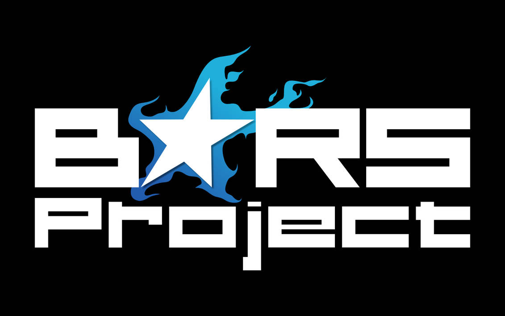

<!--
*** Thanks for remembering the game. Feel free to contribute and most importantly. Have fun!

<!-- PROJECT SHIELDS -->
[![Build Status][build-shield]]()
[![Contributors][contributors-shield]]()

 

  
  
  <h3 align="center">BRS Project: Nostalgia</h3>

  

    Cuz we're all retarded enough to keep the game alive!
     

<!-- TABLE OF CONTENTS -->
## Table of Contents

* [About the Project](#about-the-project)
* [Getting Started](#getting-started)
  * [Prerequisites](#prerequisites)
  * [Installation](#installation)
* [Contributing](#contributing)
* [Contact](#contact)

<!-- ABOUT THE PROJECT -->
## About The Project

A team of old mod makers, influencers and fans of the original game deciding to work together to create 1 last update.

Here's why:
* Nostalgia.
* Some still care about the game.
* To test ourselves and see how much we've changed throughout the years.
* To finally work with other mod makers out there.

Of course, we don't want you to waste your time or dedicate your life to this. It's a fan project which you decide how much you work on. All contributions are accepted.

<!-- GETTING STARTED -->
## Getting Started

To be honest if you do not know how to get started you shouldn't even be here in the first place.
But just to be nice.

### Prerequisites

* Any IDE compatible for .Net/C#
[Visual studio 2019](https://visualstudio.microsoft.com/thank-you-downloading-visual-studio/?sku=Community&rel=16)
[Visual studio code](https://code.visualstudio.com/docs?dv=win&wt.mc_id=DX_841432&sku=codewin)

* Any Git GUI client
[Github Desktop](https://central.github.com/deployments/desktop/desktop/latest/win32)
[GitKraken](https://www.gitkraken.com/download/windows64)
[SourceTree](https://product-downloads.atlassian.com/software/sourcetree/windows/ga/SourceTreeSetup-3.1.3.exe)

### Installation

1. Install any IDE of your choice
2. Clone the repo using any of the clients you've downloaded
3. Open the .sln file
4. Done, have fun coding.

<!-- CONTRIBUTING -->
## Contributing

Contributions are what make the open source community such an amazing place to be learn, inspire, and create. Any contributions you make are **greatly appreciated**.

1. Clone the project
2. Go to our [Project Feature Wall](https://github.com/Erenx447/BRS-Mod/projects/1)
3. Assign yourself a feature on the to do list or add your own and work on it
4. Write your code
5. Test your code by checking all functionalities of the base game and previous mods
6. Find and fix the bugs caused by your code
7. Commit your Changes
8. Push to the Branch 
9. Open a Pull Request
10. Wait for feedback by the team 
11. Apply the feeback from the team (fix bugs found by them, change code for compatibility reasons, etc etc)
12. Feel proud and credit yourself for the feature you've contributed.

<!-- CONTACT -->
## Contact

* [Discord group](https://discord.gg/fCrUsbf)

* Feel free to add your own preferred contact method down below

Black Rock Shooter - **Discord**: Meliodas#6452

Project Link: [BRS Mod](https://github.com/Erenx447/BRS-Mod)

<!-- MARKDOWN LINKS & IMAGES -->
[build-shield]: https://img.shields.io/badge/build-passing-brightgreen.svg?style=flat-square
[contributors-shield]: https://img.shields.io/badge/contributors-1-orange.svg?style=flat-square
